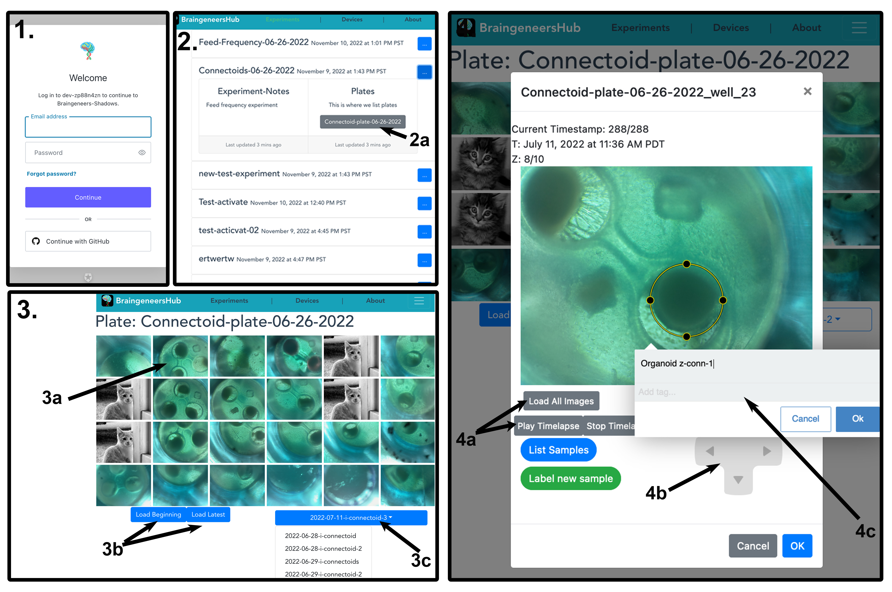

# Datahub
A vue based web application for viewing data from the shadows database


1: Access control handled with Auth0 authentication; 2: The experiment selection screen, selecting an experiment opens a collapsable view where notes and plates (2a) are shown; 3: The plate view, showing all wells for a given plate, clicking a well (3a) opens the single well view (4), controls for loading thumbnails for the beginning and end of the dataset are given (3b), 3c shows a dropdown menu for all image sets associated with a plate; 4: Single well view, 4a loads a timeseries for a given layer and plays a timelapse, 4b allows navigation through z-stack layers and timesteps, 4c is the sample tagger where annotations can be added to the image and identified as samples of interest.

## For local development
- [clone repo]()
- configure .env file with appropriate location of shadows API endpoint
- npm run serve

##  For deployment on server
- [clone repo]()
- configure .env file with appropriate endpoint location
- docker-compose up -d


## Project setup
```
npm install
```

### Compiles and hot-reloads for development
```
npm run serve
```

### Compiles and minifies for production
```
npm run build
```

### Lints and fixes files
```
npm run lint
```

### Customize configuration
See [Configuration Reference](https://cli.vuejs.org/config/).
